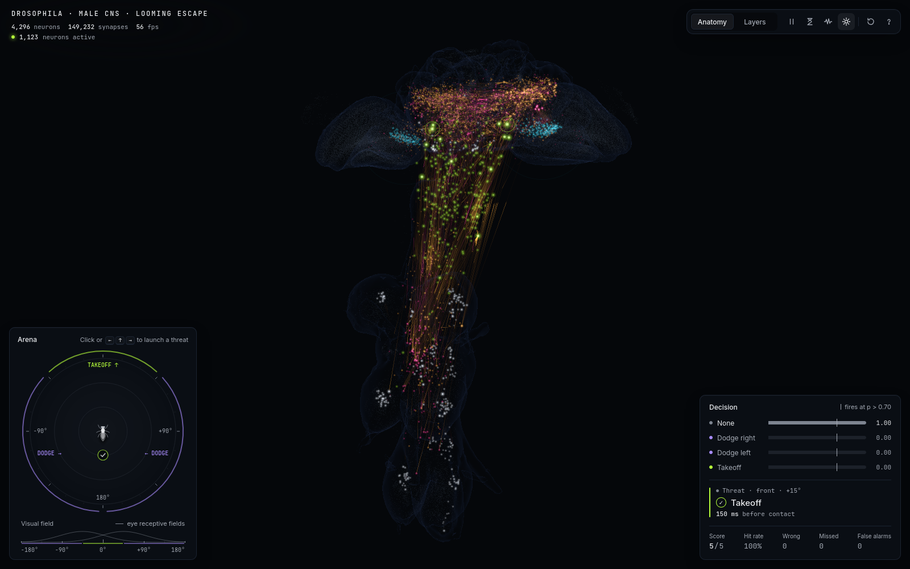

# Fly Brain Escape

A real circuit from the fruit fly connectome, trained to escape looming threats and running live in your browser.

4,296 neurons and 149,232 synapses were taken from the [MaleCNS v1.0 connectome](https://male-cns.janelia.org/) (HHMI Janelia + Google Research, released June 2026), wired exactly as they are in the fly: looming-detector neurons in the eyes → interneurons → descending neurons → motor neurons. The circuit is simulated as a signed rate network, trained on a small escape task, and then runs in the browser at 60 fps while you throw threats at it.



## Quick start

```bash
git clone https://github.com/ak7660/fly-brain-escape.git
cd fly-brain-escape
./run_demo.sh          # serves the demo at http://localhost:8000
./run_demo.sh demo     # threats launch automatically (for screen recording)
```

Nothing to install and no build step: the browser app is plain ES modules, and the trained circuit ships as a 4.4 MB binary bundle in `web/assets/circuit_v1/`.

**Controls:** ← ↑ → (or click the arena) launch a threat from the left, front or right · Shift = faster threat · **L** anatomy ↔ layers view · **Space** pause · **S** slow motion · **N** input noise · **B** bloom · **R** reset · **?** help.

## What you are looking at

- **Arena (bottom left):** a top-down view with the fly at the centre. Threat discs grow as they approach, exactly as a looming object grows in the fly's visual field. The strip below shows what each eye sees.
- **3D brain:** every neuron at its real anatomical position inside the fly's brain and nerve cord. Cyan = looming detectors in the optic lobes, amber = excitatory interneurons, pink = inhibitory, lime = descending neurons (the two with reticles are the **Giant Fibers**, the fly's jump-escape neurons), white = motor neurons. Brightness is each neuron's activity above rest; streaks are signals travelling along real synapses. Press **L** to unfold the same network into input → hidden → descending → motor layers.
- **Decision panel (bottom right):** live probabilities for *none*, *dodge right*, *dodge left* and *takeoff*. The network commits when one stays above 0.70 for three frames, typically ~300 ms before contact.

## Results

Three variants, three seeds each, identical data and training budget, scored on 1,200 held-out episodes that include loom speeds never seen during training.

| wiring | held-out accuracy | iterations to 90% | decision before contact |
|---|---|---|---|
| **real connectome** | **99.9% ± 0.1** | **30** | 228 ms |
| shuffled (same degrees, same layer structure) | 97.9% ± 1.6 | 77 | 144 ms |
| readout only (circuit frozen) | 95.1% ± 0.2 | 83 | 83 ms |


**What this supports** (claim rule fixed before training: a gap must exceed 2 pooled standard deviations):

- ✅ The real wiring learns this task **~2.6× faster** than the same network with shuffled wiring.
- ❌ It is **not** more accurate than shuffled wiring: both saturate, and the gap is inside the noise.
- ⚠️ The task is easy. A linear classifier reading the eye neurons directly scores 100%. The result is that a real connectome is a better *starting point for learning*, not that only a fly brain can solve it.
- Silencing the input neurons drops the trained model to chance (21%), so the decisions really do depend on the visual pathway.

Full write-up with caveats: [`docs/results.md`](docs/results.md). Every number comes from `results/summary.json`.

## How it works

```
MaleCNS connectome (31 GB)
  └─ circuit extraction      neurons on short paths from LPLC2/LC4 looming detectors to descending neurons
  └─ signs + weights         acetylcholine +1; GABA/glutamate/histamine −1; weight = synapses ÷ the target's total input
  └─ rate model (PyTorch)    r ← (1−α)·r + α·clip(W·r + bias + input, 0, r_max), 4 substeps per 60 Hz frame
  └─ training                only ~8k type-level parameters; the wiring is never modified
  └─ export                  4.4 MB binary bundle + JSON manifest
        └─ browser           the same maths in JavaScript, verified to match Python to 1e-14
```

**What is real and fixed:** which neurons exist, which connect to which, how many synapses, and whether each neuron excites or inhibits. Training cannot add, remove or re-route a connection, and cannot flip a sign.

**What is learned (7,999 numbers against 149,232 fixed synapses):** a global gain, per-cell-type send/receive gains, baselines and time constants, plus a 1,204-parameter readout from the descending neurons to the four actions. The connectome gives structure but no physiology and no meaning for the output: training supplies those. Notably, the cell type training boosted most is **LC4 (×1.50)**, the looming-velocity detector that is the Giant Fiber's strongest input.

**Training data:** the wiring is real; the task episodes are generated (`flybrain/stimulus.py`). Each episode is 1.2 s at 60 fps with a threat from the left, front or right (or none), random approach speed, per-neuron gain jitter and noise. 9,600 episodes per run, never repeated.

## Repo layout

| path | what |
|---|---|
| `flybrain/` | Python: connectome I/O, circuit extraction, stimulus, rate model, training, evaluation, export, figures |
| `web/` | browser app: bundle loader, live model, three.js scene, arena game, HUD (no build step, no npm deps) |
| `web/assets/circuit_v1/` | the exported trained circuit |
| `tests/`, `web/tests/` | 102 Python tests, 65 JS tests (including Python↔JS parity) |
| `docs/` | research notes with citations, figures, results |
| `results/` | training metrics per run, calibration and evaluation summaries |

## Reproducing the pipeline

Needs the raw data (~31 GB, free, CC-BY) from [male-cns.janelia.org/download](https://male-cns.janelia.org/download/) in `data/flat-connectome/`, plus [uv](https://docs.astral.sh/uv/) and Node 20+.

```bash
uv sync
uv run python -m flybrain.circuit      # extract the circuit           (~1 min)
uv run python -m flybrain.positions    # 3D positions from synapses    (~20 s)
uv run python -m flybrain.calibrate    # pick the operating point      (~3 min)
./scripts/run_training.sh              # 9 runs                        (~1 h, CPU)
uv run python -m flybrain.evaluate     # held-out tests + controls
uv run python -m flybrain.export --checkpoint results/runs/real_s2/ckpt_best.pt

uv run pytest          # 102 Python tests
cd web && node --test  # 65 JS tests
```

## Credits and licence

- **Connectome data:** MaleCNS v1.0, HHMI Janelia FlyEM with Google Research, University of Cambridge and the MRC LMB, CC-BY 4.0. See [male-cns.janelia.org](https://male-cns.janelia.org/).
- **Science this builds on:** Ache et al. 2019 (Giant Fiber looming pathway), Klapoetke et al. 2017 (LPLC2), Shiu et al. 2024 (whole-brain LIF model), Lappalainen et al. 2024 (connectome-constrained networks). Details in [`docs/research.md`](docs/research.md).
- **Code:** MIT.

This is a demo and a learning exercise, not a simulation of a fly. It models one pathway with a simplified rate model, predicted neurotransmitter signs, no gap junctions and an invented three-way action rule.
