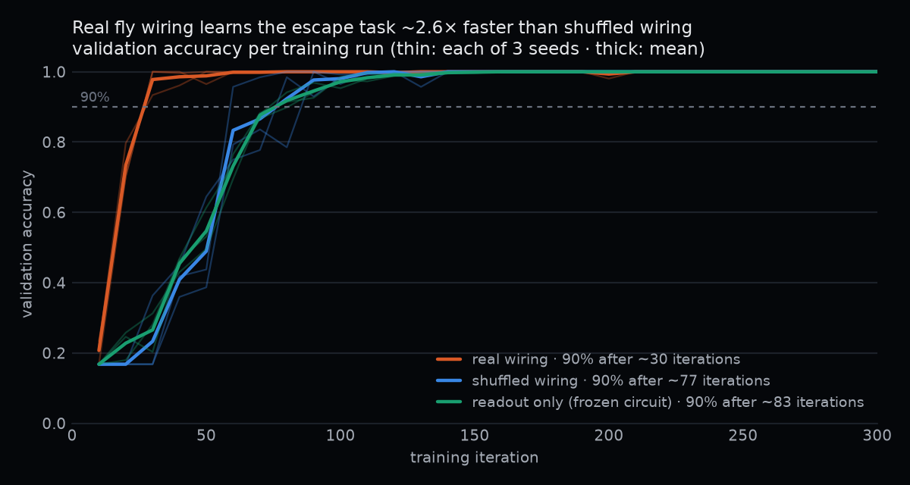
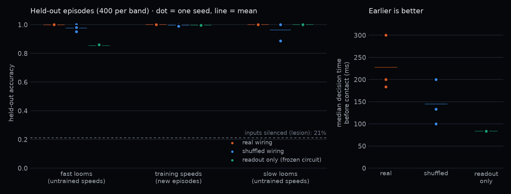

# Results — can a real fly-brain circuit learn to escape?

All numbers are generated from `results/summary.json` (`uv run python -m flybrain.evaluate`); figures by `flybrain/report.py`.

## Setup (fixed before training)
- **Circuit v1**: 4,296 neurons / 149,232 synapses from the MaleCNS connectome — LPLC2 + LC4 looming detectors → hidden interneurons → 300 descending neurons (DNs) → 301 motor neurons. Signs from predicted neurotransmitters; wiring never changes.
- **Model**: signed rate network. 7,999 trainable numbers: 6,795 per-cell-type values (global gain, send/receive gains, biases, time constants) plus a 1,204-parameter linear readout from the DNs to 4 actions (none, dodge right, dodge left, takeoff). The 149,232 synaptic weights and their signs are fixed.
- **Variants** (3 seeds each, identical data/optimiser/budget: Adam lr 1e-2 × 300 iterations, batch 32): *real* wiring; *shuffled* wiring (edges rewired within the same layer blocks, degrees and input scale preserved); *readout only* (calibrated circuit frozen, only the readout learns).
- **Decision rule** (shared with the browser demo): an action fires when its probability exceeds 0.7 for 3 consecutive frames.
- **Held-out test**: 400 new episodes in each of three loom-speed bands — *fast* (l/v 15–20 ms) and *slow* (60–80 ms) were never seen in training; *trained* (20–60 ms) uses new episodes.
- **Claim rule (pre-registered)**: "real beats X" only if mean(real) − mean(X) > 2 pooled SDs.

## Results
| variant | held-out accuracy | fast | trained | slow | false alarms | decision before contact (median) | iterations to 90% (seeds) |
|---|---|---|---|---|---|---|---|
| real wiring | 99.9% ± 0.1 | 99.8% | 100.0% | 100.0% | 0.0% | 228 ms | 30 (30, 30, 30) |
| shuffled wiring | 97.9% ± 1.6 | 97.8% | 99.7% | 96.2% | 0.0% | 144 ms | 77 (60, 80, 90) |
| readout only | 95.1% ± 0.2 | 85.5% | 99.7% | 100.0% | 0.0% | 83 ms | 83 (90, 80, 80) |

- **Lesion** (real models with inputs silenced): 21.2% — the share of no-threat episodes, i.e. the circuit's decisions depend entirely on the looming input.
- **Input bypass** (logistic regression straight from the 311 input cells, no connectome): 100.0%.

## What we can and cannot claim
| comparison | accuracy gap (pooled SD) | claim? | learning-speed gap in iterations (pooled SD) | claim? |
|---|---|---|---|---|
| real vs shuffled | 2.1 pts (1.1) | no | 47 (11) | **yes** |
| real vs readout only | 4.9 pts (0.1) | **yes** | 53 (4) | **yes** |

1. **The real wiring learns the task about 2.6× faster than the same network with shuffled wiring** (90% validation accuracy after 30 vs 77 iterations; every real seed at 30). This passes the pre-registered 2-pooled-SD rule.
2. **Accuracy alone does not separate real from shuffled wiring**: both end near ceiling (99.9% vs 97.9%); the gap is below 2 pooled SDs, so we make no accuracy claim.
3. **Training the circuit beats training only the readout** on both accuracy and learning speed; the frozen circuit struggles most with fast looms (85.5%).
4. **Descriptive, not pre-registered**: trained real circuits commit to an action earlier (228 ms before contact vs 144 ms shuffled, 83 ms readout-only).
5. **The task is easy**: a linear classifier on the raw inputs reaches 100.0%. The finding is that the real connectome is a *better starting point for learning* this behaviour — not that only a fly brain can solve it. With 3 seeds per variant and evaluations every 10 iterations, the learning-speed estimate is coarse.

## Pre-registration
Fixed before any variant was trained: the three variants and their identical budgets, the held-out bands, the decision rule, the metrics, and the claim rule ("real beats X" only if the mean gap exceeds 2 pooled SDs). The learning-speed comparison was added after a 40-iteration pilot of the real circuit showed accuracy would saturate, and before any shuffled or readout-only run existed. Gate v2 for calibration was revised after inspection (see `docs/research.md`); all variants share the resulting starting point.

## Caveats
- **"Type-level" is weaker than it sounds.** The circuit has 1,698 cell types for 4,296 neurons: 423 types are singletons and 53.6% of neurons sit in a type with ≤2 members, so for half the circuit a per-type gain is effectively per-neuron. Both the real and shuffled variants share the identical type partition, so the learning-speed comparison is unaffected, but this is one reason a shuffled circuit also reaches ceiling accuracy.
- **Latency is conditioned on success.** Median decision time is computed only over episodes a variant got right, so each variant's median covers a different subset (real ~99.9% of episodes, readout-only ~94%).
- **Empty vs threat episodes are masked differently.** Threat episodes stop at contact (36–60 of 72 frames) while empty episodes run the full 72, giving them more opportunity to false-alarm; the reported 0.0% false-alarm rate is therefore slightly conservative.
- **Resting state refresh.** For the real and shuffled variants the simulation's starting state is recomputed at each evaluation rather than every iteration, so most gradient steps start from a slightly stale resting state. Both variants are treated identically; readout-only (frozen circuit) is exact throughout.
- **When each comparison was fixed:** the original plan pre-registered only the accuracy comparison. The learning-speed comparison (iterations to 90%, same 2-pooled-SD rule) was added to `flybrain/evaluate.py` after a 40-iteration pilot of the real circuit showed accuracy would saturate, and before any shuffled or readout-only run existed.
- Neurotransmitter signs are predictions (~91% confident on average); electrical synapses (e.g. Giant Fiber → jump motor neuron) are absent from the chemical-synapse data.
- The shuffled control preserves layer-block edge counts, degrees, per-neuron output weights and input scale; other structure (e.g. which cell types connect) is destroyed — that is what it tests.
- Calibration gate v1 was revised to v2 after inspection (documented in `docs/research.md`); all variants share the same calibrated starting point.
